# ShoghlOnline — Complete Two-User Flows (Visual)

> One account, two **modes** (`find_job` = Worker, `find_worker` = Employer). Mode is a **view toggle only — never authorization** (FR-MODE-4). All gating is relationship-based (contract party / resource owner).
>
> Render: open this file in the VS Code Markdown preview (Mermaid supported) or on GitHub.

## Legend of moderation toggles (decide live-vs-pending everywhere)

| Flag | Default | ON | OFF |
|---|---|---|---|
| `jobs.auto_publish` | **False** | Job → `PUBLISHED` + subscriber fanout | Job → `PENDING_REVIEW` (admin approves) |
| `proposals.auto_publish` | **True** | Proposal → `SUBMITTED` | Proposal → `PENDING_APPROVAL` (moderator passes) |
| `services.auto_publish` | **False** | Service → `LIVE` | Service → `PENDING_REVIEW` (admin approves) |
| `profiles.auto_publish` | **False** | Profile → `PUBLISHED` | Profile → `PENDING_REVIEW` (admin approves) |
| `profiles.publish_min_completeness` | **70** | Completeness gate to allow publishing. `80` = stricter; **`0` = publish all (no gate)** | Admin-tunable in GlobalSetting admin |
| `bids.enabled` | **True** | Proposal costs 1 bid; signup grants 10 | Proposals free; no grants/purchases |
| `payments.commission_pct` | **10%** | Frozen at contract creation (override by CommissionTier) | — |

---

## 1. Auth & Onboarding (new vs returning)

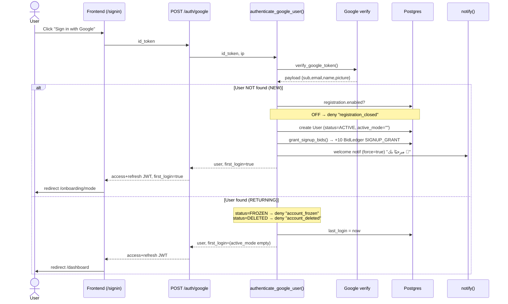

### Onboarding branch by mode

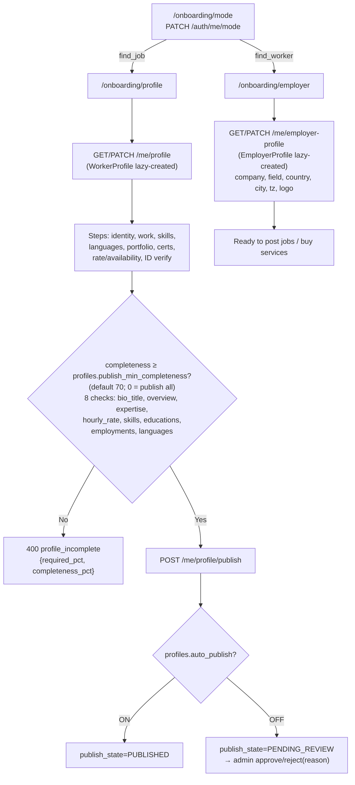

> **Account deletion** (`DELETE /auth/me`): blocked (409) if open contracts, non-zero wallet, pending withdrawals, or pending service requests (BR-2). On success → soft-delete (status=DELETED), anonymize PII, close listings, lock chats; ledger retained; `google_sub` freed for re-register.

---

## 2. State machines

### Job

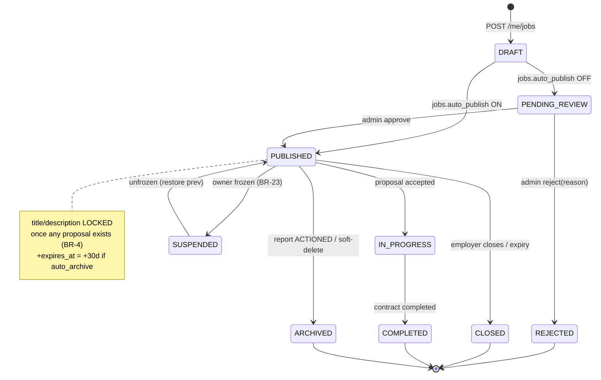

### Proposal

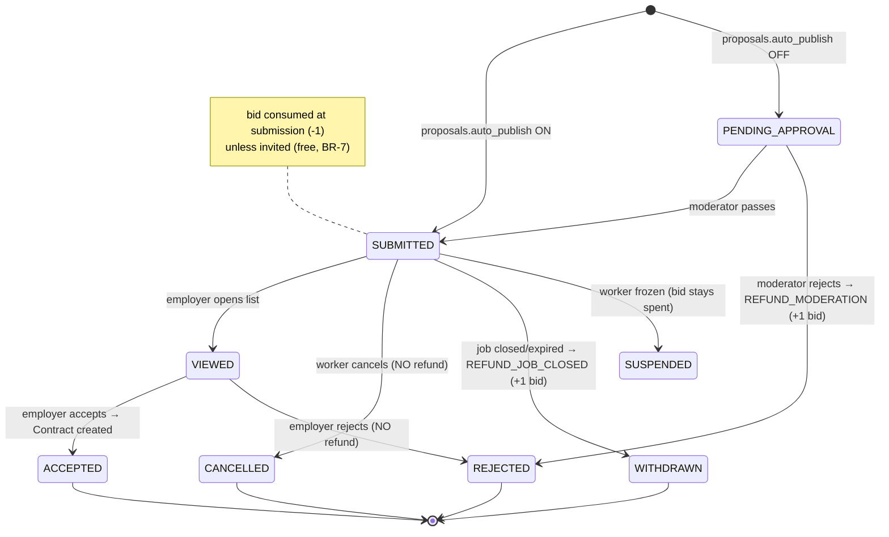

### Service & Buying Request

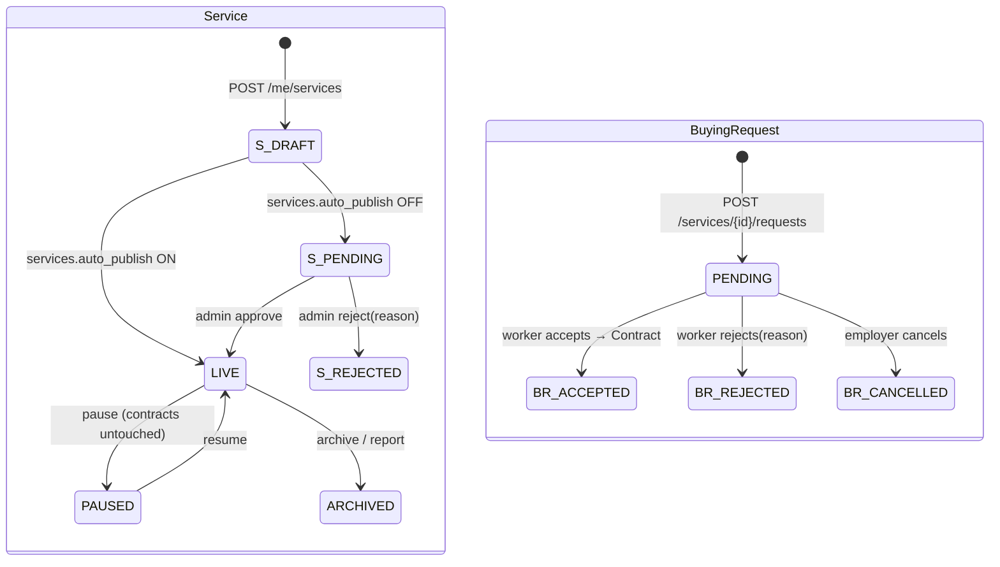

### Contract (the core money state machine)

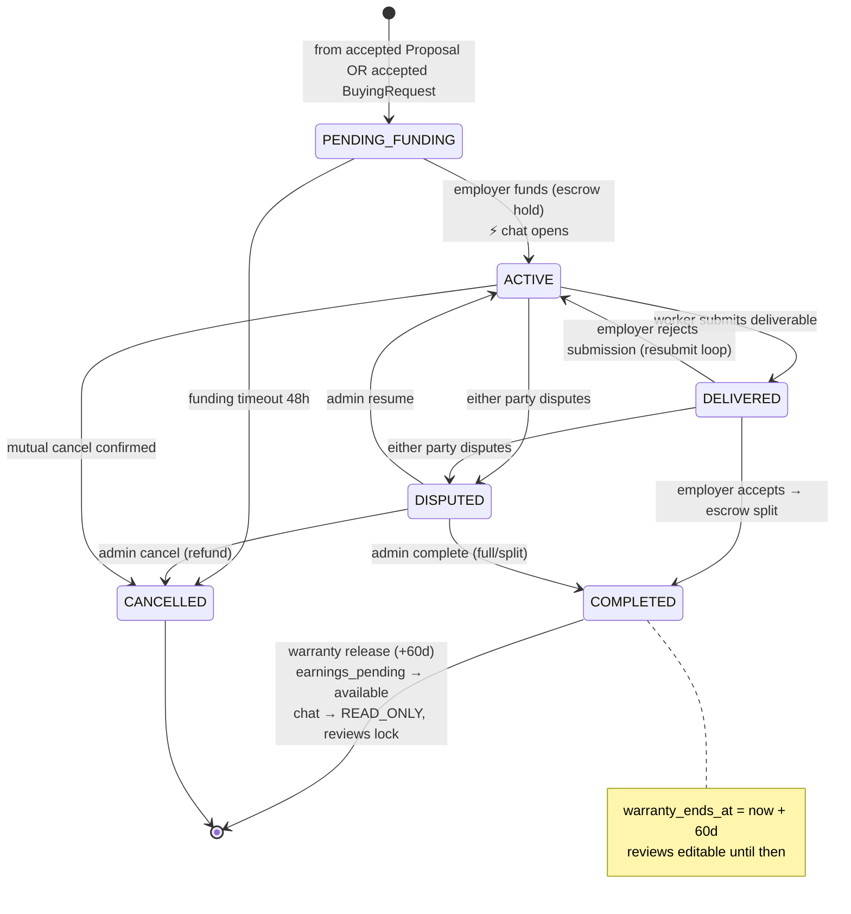

---

## 3. Golden path A — Job → Proposal → Contract → Delivery → Release

```mermaid
sequenceDiagram
    actor Emp as Employer
    actor Wrk as Worker
    participant Adm as Admin/Moderator
    participant Sys as Backend
    participant Wal as Wallet/Ledger
    participant N as Notifications

    Emp->>Sys: POST /me/jobs
    alt jobs.auto_publish OFF
        Sys->>Adm: Job PENDING_REVIEW
        Adm->>Sys: approve
    end
    Sys->>N: Job PUBLISHED → fanout to category subscribers
    Wrk->>Sys: POST /jobs/{id}/proposals (+ screening answers)
    Note over Sys: validate self-deal/dup/required answers
    alt bids.enabled & not invited
        Sys->>Wal: consume_bid (-1, needs ≥1)
    end
    alt proposals.auto_publish OFF
        Sys->>Adm: Proposal PENDING_APPROVAL
        Adm->>Sys: pass (or reject→refund bid)
    end
    Sys->>N: notify Employer "عرض جديد"
    Emp->>Sys: GET /me/jobs/{id}/proposals (→ VIEWED)
    Emp->>Sys: POST /proposals/{id}/accept
    Sys->>Sys: Contract PENDING_FUNDING; Job IN_PROGRESS; invitations EXPIRE
    Emp->>Sys: POST /contracts/{id}/fund
    Sys->>Wal: available -budget ; escrow_held +budget (CONTRACT_HOLD x2)
    Sys->>Sys: Contract ACTIVE; auto-open Conversation
    Sys->>N: notify BOTH "تم تمويل العقد"
    Wrk->>Sys: POST /contracts/{id}/submissions (notes+files)
    Sys->>Sys: Submission OPEN; Contract DELIVERED
    Sys->>N: notify Employer "تم التسليم"
    alt reject
        Emp->>Sys: POST /submissions/{id}/reject(reason)
        Sys->>Sys: Submission REJECTED; Contract ACTIVE (loop)
    else accept
        Emp->>Sys: POST /submissions/{id}/accept
        Sys->>Wal: escrow_held -budget ; worker earnings_pending +worker_earning ; platform available +commission
        Sys->>Sys: Contract COMPLETED; warranty_ends_at=+60d
        Sys->>N: notify BOTH "بدأت فترة الضمان"
    end
    Note over Sys,Wal: Celery release_due_warranties (after 60d)
    Sys->>Wal: worker earnings_pending -x ; available +x
    Sys->>Sys: funds_released=true; chat READ_ONLY; reviews LOCK; affiliate accrue
    Emp-->>Sys: POST /contracts/{id}/reviews (1-5★)
    Wrk-->>Sys: POST /contracts/{id}/reviews (1-5★)
    Wrk->>Sys: POST /me/withdrawals (min $10)
    Sys->>Wal: WITHDRAWAL_HOLD (available -amount)
    Adm->>Sys: process → PAID (or REJECTED→reversed)
```

## 3b. Golden path B — Service → Buying Request → Contract

```mermaid
sequenceDiagram
    actor Wrk as Worker
    actor Emp as Employer
    participant Sys as Backend
    Wrk->>Sys: POST /me/services → (auto_publish) LIVE or PENDING_REVIEW→approve
    Emp->>Sys: POST /services/{id}/requests (qty, add-ons; total frozen)
    Sys->>Wrk: notify "طلب جديد على خدمتك" (BuyingRequest PENDING)
    Wrk->>Sys: POST /requests/{id}/accept
    Sys->>Sys: Contract PENDING_FUNDING
    Note over Emp,Sys: from here identical to path A:<br/>fund → deliver → accept → warranty → review
```

---

## 4. Chat — client-write Firestore + backend control plane

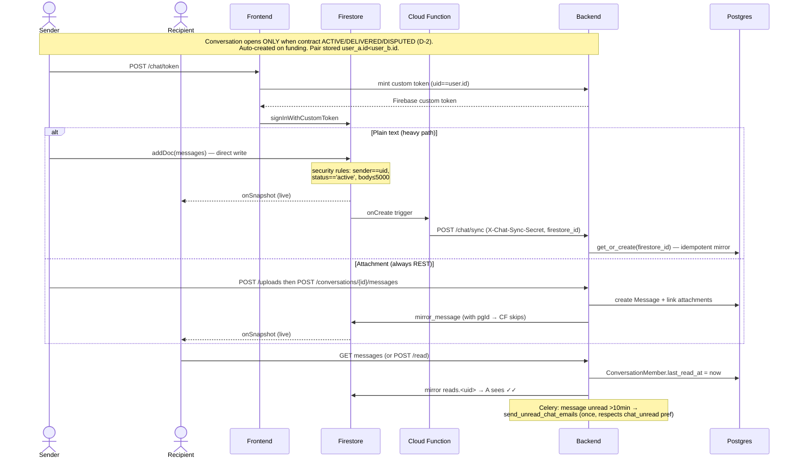

### Chat lifecycle & safety

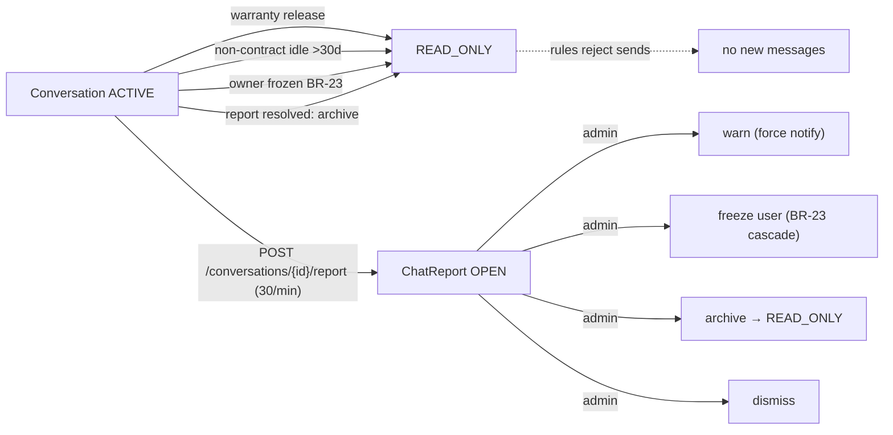

---

## 5. Money & escrow (three buckets)

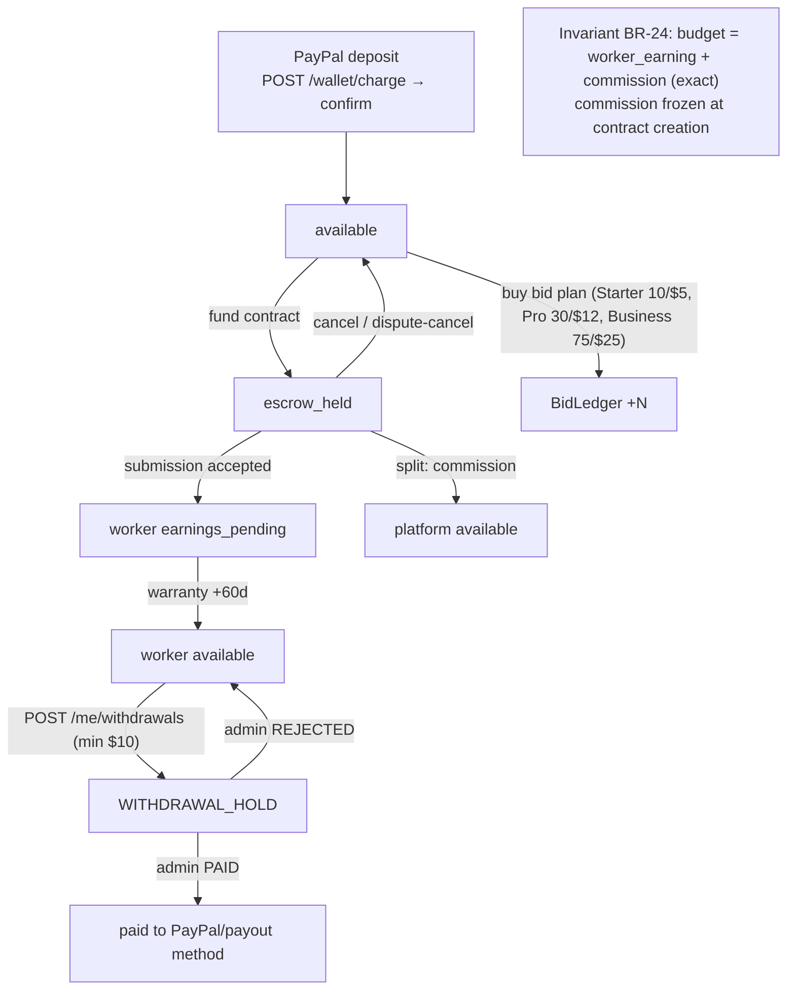

### Bid ledger (append-only; balance = Σ deltas)

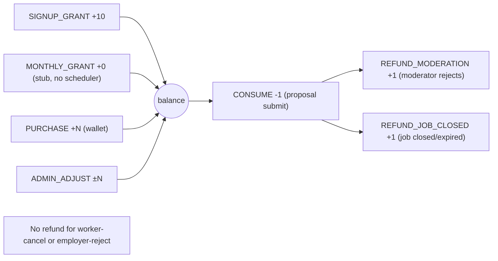

---

## 6. Notifications fan-out

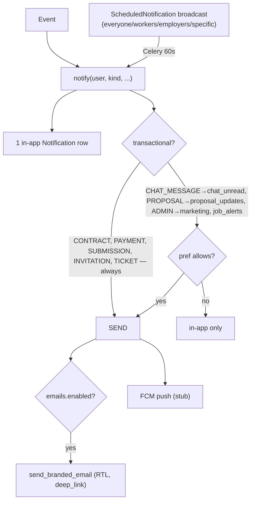

---

## 7. Trust & safety

### Content reports (Report: SERVICE/JOB/FREELANCER/PORTFOLIO/PROPOSAL/BUYING_REQUEST)

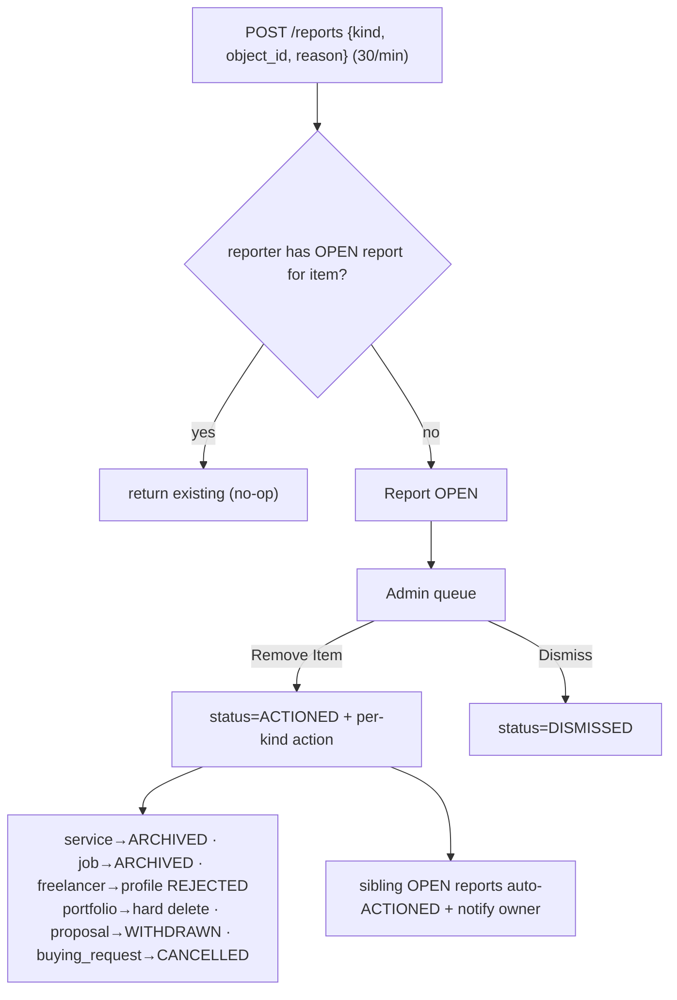

### Support ticket lifecycle + dispute bridge (BR-22)

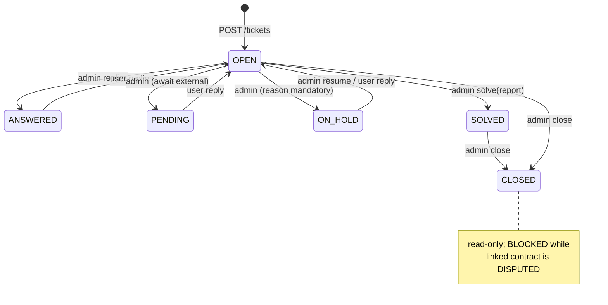

```mermaid
sequenceDiagram
    actor P as Party
    participant Sys as Backend
    participant Adm as Admin
    participant T as Ticket (is_dispute)
    P->>Sys: POST /contracts/{id}/dispute  (ACTIVE/DELIVERED)
    Sys->>Sys: Contract DISPUTED; dispute_ticket_ref set
    Note over Sys,T: dispute-type ticket couples to contract
    Adm->>Sys: resolve outcome
    alt complete (full/split)
        Sys->>Sys: split escrow → COMPLETED
    else cancel
        Sys->>Sys: refund employer → CANCELLED
    else resume
        Sys->>Sys: back to ACTIVE/DELIVERED
    end
    Sys->>T: _close_coupled_ticket() → CLOSED
```

### Reviews & warranty window

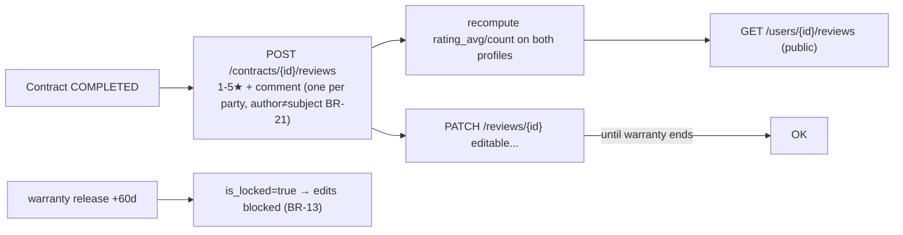

### ID verification

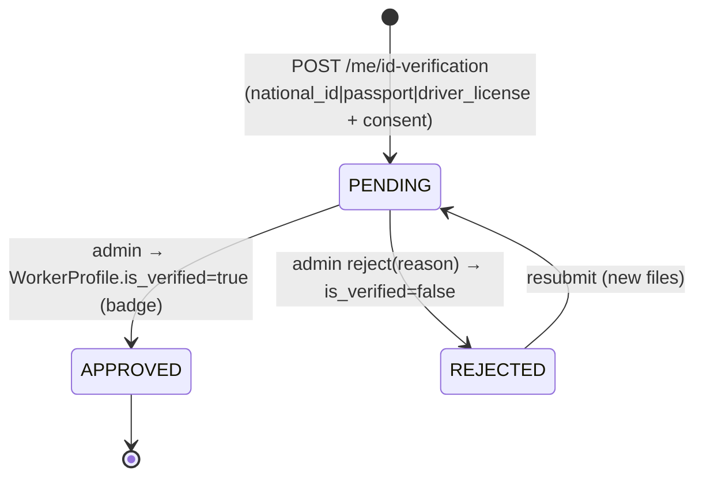

---

## 8. Affiliate funnel (BR-18)

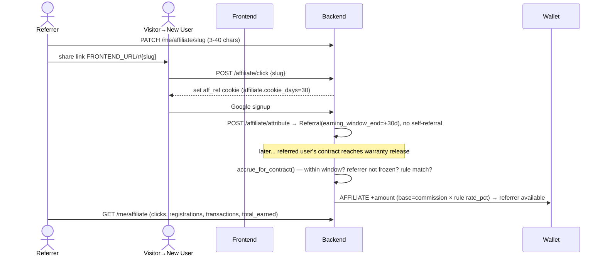

---

## 9. Discovery & engagement

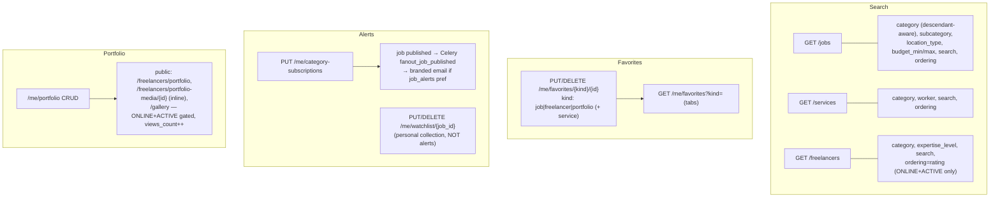

---

## 10. Freeze cascade (BR-23)

```mermaid
flowchart TD
    FR["Admin freeze user"] --> U["User FROZEN (login blocked)"]
    U --> J["Job PUBLISHED → SUSPENDED"]
    U --> S["Service LIVE → PAUSED"]
    U --> P["Proposal open → SUSPENDED (bid stays spent)"]
    U --> I["Invitation SENT → SUSPENDED"]
    U --> C["Conversation ACTIVE → READ_ONLY"]
    U --> A["Affiliate accrual stops"]
    U --> K["Open contracts: counterpart notified; escrow held"]
    note1["each stores frozen_prev_status"]
    UF["Unfreeze"] --> RST["restore each from frozen_prev_status<br/>(chat stays READ_ONLY if contract COMPLETED/CANCELLED)"]
```
